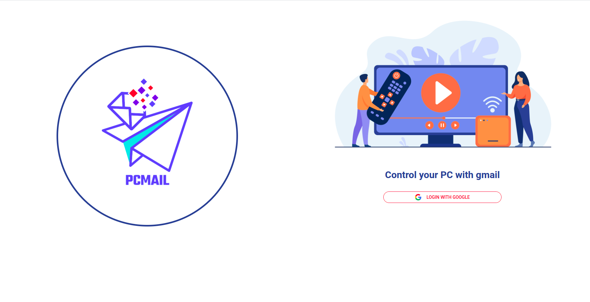
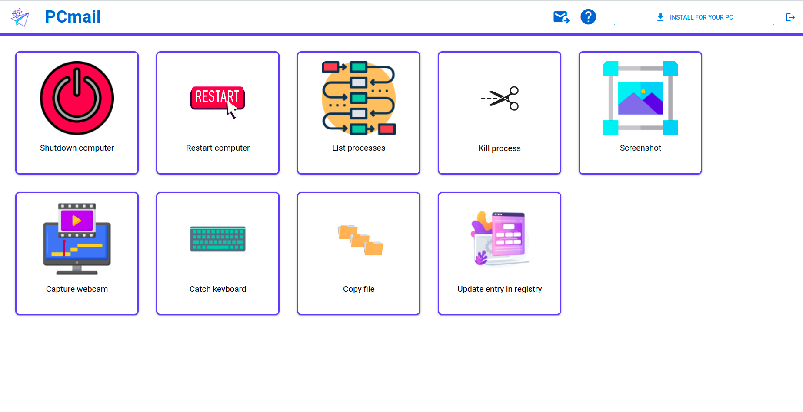
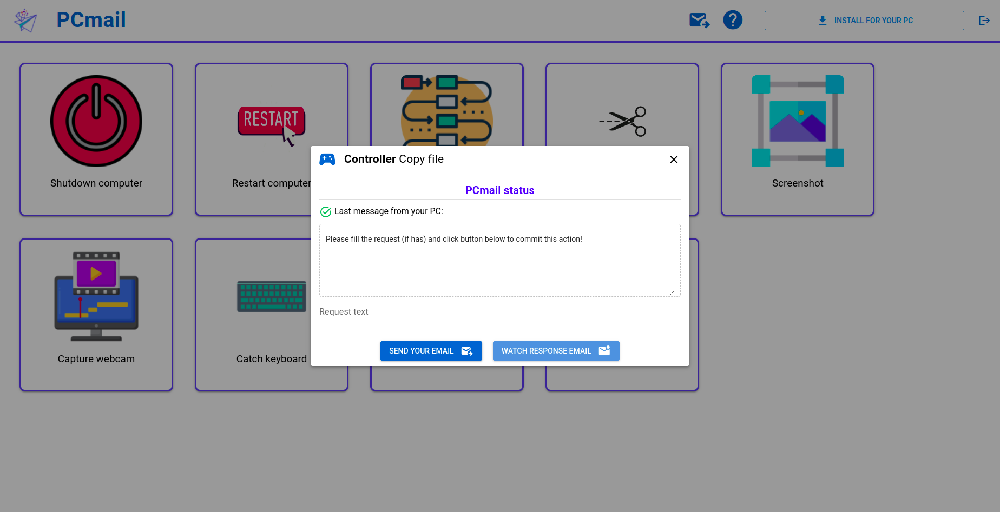
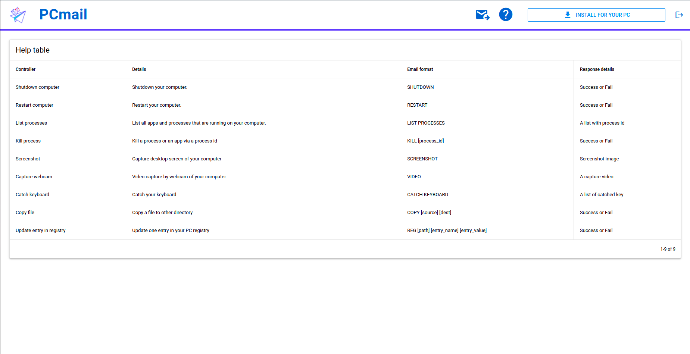

# PCmail

<p align="center">
  
</p>

## Overview
PC controller app via gmail. This project consists of 2 applications:  
- Website (for remote controller)  
- PC app  (setup in local PC)  

Our system provides several control operations:
- Shutdown or restart.  
- List processes or kill a process.  
- Screenshot or webcam capture.  
- Copy files.  
- Update an entry in registry (only window).  
- Catch keyboards.  
## System diagram


## Some captures of the website
### 1. Login screen


### 2. Main screen


### 3. Controller diaglog


### 4. Help table


## Technologies
#### 1. Website
**Frameworks**  
```
VueJs
Quasar
GmailAPI
GoogleAPI
```
**Languages**  
```
Javascript
Typescript
Vue
CSS
HTML
```
#### 2. PC application
**Packages**  
```
open-cv
PyQt
imaplib
pyautogui
email
winreg
```
**Languages**  
```
Python
```