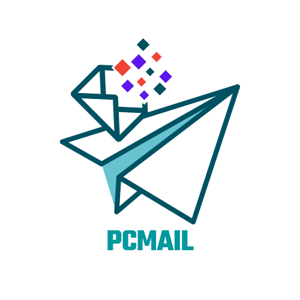
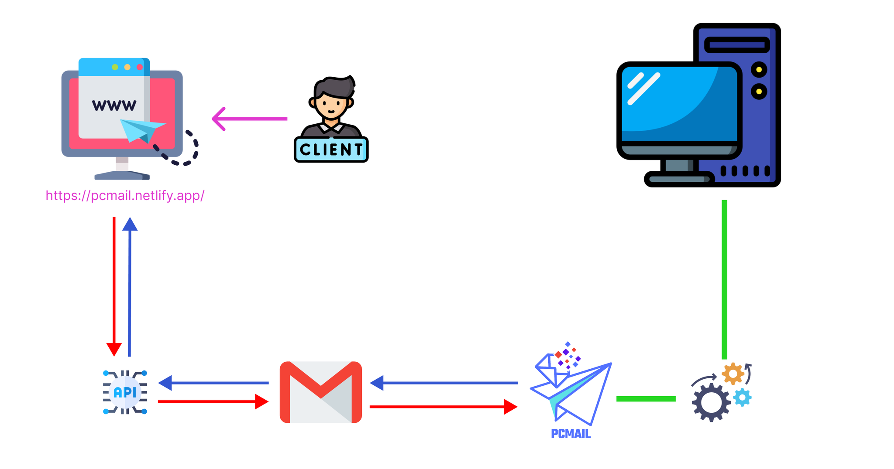

#PCmail

<p align="center">
  
</p>

### Overview
PC controller app via gmail.

### System diagram


### Technologies Index
#### 1. Website
**Frameworks**  
```
VueJs
Quasar
GmailAPI
GoogleAPI
```
**Languages**  
```
Javascript
Typescript
Vue
CSS
HTML
```
#### 2. PC application
**Packages**  
```
open-cv
PyQt
imaplib
pyautogui
email
winreg
```
**Languages**  
```
Python
```